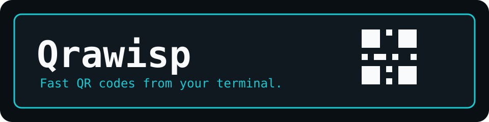
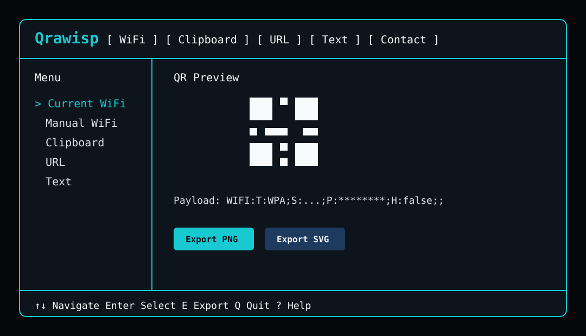

# Qrawisp ⚡

> Fast QR codes from your terminal.



[](https://github.com/david-x3d/qrawisp/actions/workflows/ci.yml)


Qrawisp is a polished, privacy-first terminal GUI for generating practical QR codes without leaving your shell. Run `qrawisp` to open the TUI, or use the secondary CLI shortcuts for scripts and power-user workflows.

## ⚡ Features

- Real TUI-first QR workflow with sidebar navigation, forms, preview, actions, status bar, help, and settings.
- Generate QR payloads for WiFi, clipboard, URLs, text, email, phone, SMS, vCards, geo links, and raw payloads.
- Export PNG, SVG, and terminal TXT QR codes with quiet-zone support for reliable scanning.
- Cross-platform WiFi detection helpers for Linux, Windows, and macOS.
- Privacy-minded defaults: masked WiFi passwords, no password history, no secret logging, and clipboard sensitivity warnings.

## 📦 Installation

```bash
npm install -g qrawisp
```

For local development:

```bash
npm install
npm run dev
```

## 🚀 Usage

Open the terminal GUI:

```bash
qrawisp
```

Use secondary CLI shortcuts:

```bash
qrawisp url d4vid.io
qrawisp text "hello world"
qrawisp clip
qrawisp email user@example.com --subject "Hello" --body "Test"
qrawisp phone +49123456789
qrawisp sms +49123456789 --message "Hello"
qrawisp vcard --name "David" --phone "+49123456789" --email "test@example.com"
qrawisp geo --lat 50.9375 --lng 6.9603
qrawisp raw "CUSTOM:PAYLOAD"
```

Export from the CLI:

```bash
qrawisp wifi --ssid "MyWiFi" --password "secret" --type WPA --format png --output wifi.png
qrawisp url https://d4vid.io --format svg --output site.svg
qrawisp text "scan me" --format txt --output qr.txt
```

## 📶 WiFi QR

Qrawisp creates standard WiFi QR payloads:

```text
WIFI:T:WPA;S:MyNetwork;P:secret123;H:false;;
```

Run `qrawisp wifi` to detect the current network where supported, or provide credentials manually.

## 📋 Clipboard QR

```bash
qrawisp clip
```

Clipboard content is checked for common secret patterns before a QR code is generated. Very long clipboard content requires confirmation in the TUI.

## 🖥 Terminal GUI



The TUI includes screens for Current WiFi, Manual WiFi, Clipboard, URL, Text, Email, Phone, SMS, vCard, Geo Location, Raw Payload, Export Manager, Settings, and Help.

Keyboard basics: `↑/↓` navigate, `Enter` select/focus, `Tab` switch fields, `E` export, `?` help, `Q` quit.

## 🔐 Security

- WiFi passwords are masked by default and are only shown with `--show-secret` or the TUI show-secret toggle.
- WiFi credentials are not stored by default.
- Qrawisp does not log passwords, clipboard contents, tokens, or generated secret payloads.
- Clipboard QR generation warns on API keys, tokens, passwords, private keys, and secret-looking environment variables.
- Current WiFi password detection depends on OS permissions and may prompt for manual input.

## 🧪 Tests

```bash
npm run typecheck
npm test
npm run build
```

## Platform Support

| Feature                 | Linux                    | Windows                       | macOS                 |
| ----------------------- | ------------------------ | ----------------------------- | --------------------- |
| Terminal GUI            | ✅                       | ✅                            | ✅                    |
| Terminal QR             | ✅                       | ✅                            | ✅                    |
| Clipboard QR            | ✅                       | ✅                            | ✅                    |
| Current WiFi SSID       | ✅                       | ✅                            | ✅                    |
| WiFi password detection | ⚠ depends on permissions | ⚠ depends on user permissions | ⚠ Keychain permission |
| PNG/SVG export          | ✅                       | ✅                            | ✅                    |

## 🗺 Roadmap

- Package publishing automation.
- Import/export TUI profiles without storing secrets by default.
- Additional QR payload templates for calendar events and app deep links.
- More terminal theme presets.

## Contributing

Issues and pull requests are welcome. Keep changes focused, add tests for payload and parser behavior, and do not include secrets or local machine configuration in commits.
